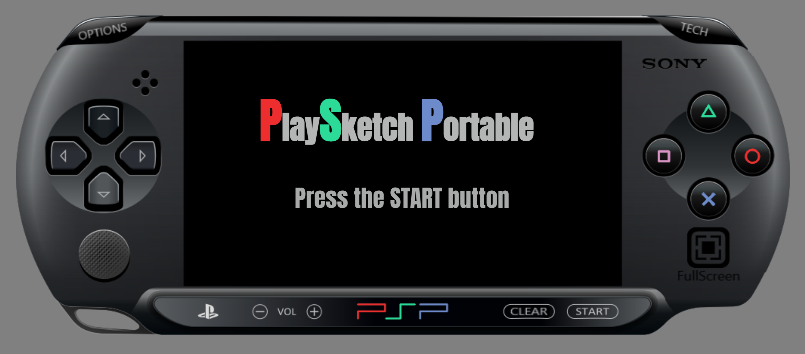

# PlaySketcher Portable
This is my twist on the basic drawing game where I try to add as much of personality as able in a simple web drawing game. The PlayStation Portable was my childhood dream come true, after begging my parents for months I got the console and I wanted to implement the design of this website to something dear to me. Check out the features such and be sure to check out the mobile version since I tried to make it responsive.

## Game Demo

To see a live demo of the game, you can visit the [Rock Paper Scissors Game Demo](https://jakaambrus.github.io/PlaySketch_Portable/) page.

## Technologies used:

## Preview

